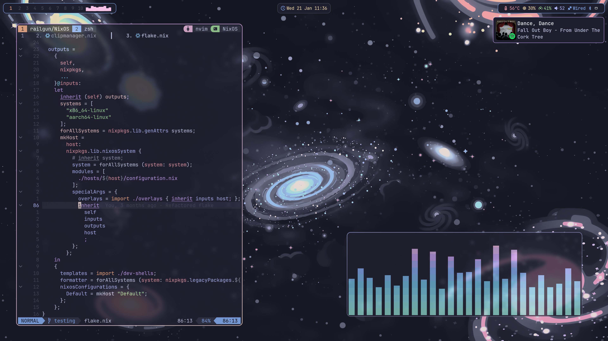
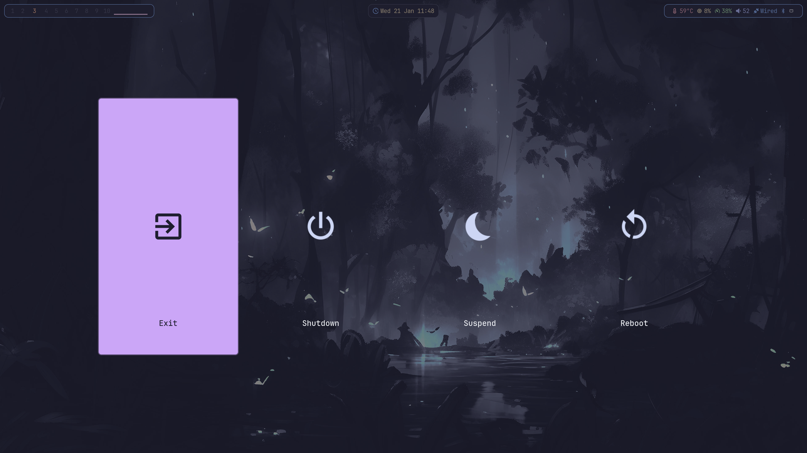
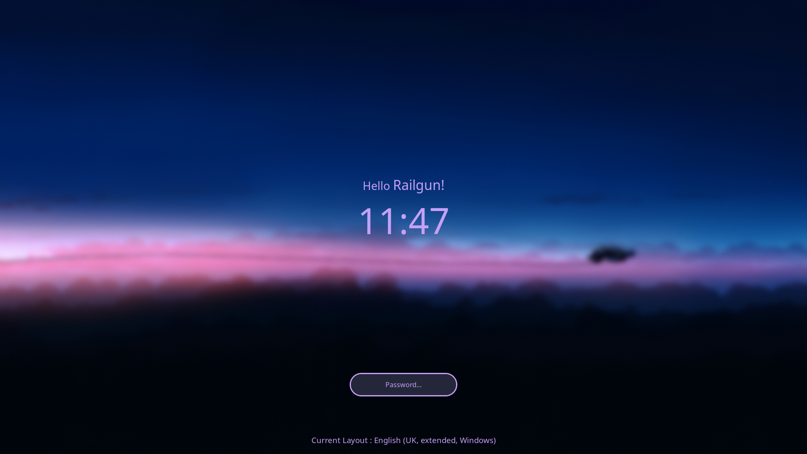

<h1 align="center">
    
   <br>
      My NixOS Configuration
   <br>
       <br>
   <div align="center">

   <div align="center">
      <p></p>
      <div align="center">
         <a href="https://github.com/Sly-Harvey/NixOS/stargazers">
            
         </a>
         <a href="https://github.com/Sly-Harvey/NixOS/network/members">
            
         </a>
         <!-- <a href="https://github.com/Sly-Harvey/NixOS/"> -->
         <!--     -->
         <!-- </a> -->
         <a = href="https://nixos.org">
            
            <!--  -->
         </a>
         <a href="https://github.com/Sly-Harvey/NixOS/blob/main/LICENSE">
            
         </a>
      </div>
      <br>
   </div>
</h1>

## Screenshots


<details>
<summary>More screenshots</summary>





</details>

## Table of Contents

- [Installation](#installation)
  <!-- - [Before You Begin](#before-you-begin) -->
  <!-- - [Installation Steps](#installation-steps) -->
- [Usage](#usage)
  - [Managing Hosts](#managing-hosts)
  - [Rebuilding](#rebuilding)
  - [Rollbacks](#rollbacks)
  - [Keybindings](#keybindings)
- [Development Shells](#development-shells)
- [Credits](#creditsinspiration)

## Installation

This repository currently has one concrete NixOS host: **Singularity**.

The old `install.sh` / `live-install.sh` workflow has been retired because it
created new machines by copying an existing host directory, which could carry
disk UUIDs, hardware configuration, tuning, and other installation-specific
state onto unrelated hardware.

For the current machine, the canonical configuration is:

```text
nixosConfigurations.Singularity
hosts/Singularity/
networking.hostName = "Singularity"
```

For a reinstall or a future second machine, see
[`docs/host-onboarding.md`](../docs/host-onboarding.md). Do **not** create a new
host by copying `hosts/Singularity`. New hardware must get its own generated
hardware configuration and explicit machine-specific storage/network facts.

## Usage

### Managing Hosts

`Singularity` is currently the only registered real host. Additional machines
will be added as explicit `nixosConfigurations.<HostName>` entries after their
own hardware/install facts are created. Support variants such as alternate
editors/desktops are tests, not additional hosts.

### Rebuilding

Apply configuration changes:

- **Keyboard shortcut:** `Super + U`
- **rebuild script:** `rebuild`
- **nixos-rebuild:** `sudo nixos-rebuild switch --flake ~/NixOS#<HOST>`
- **nh (current host; `NH_FLAKE` is configured):** `nh os switch`
- **nh (explicit host):** `nh os switch -H <HOST>`

For this machine, use `Singularity`. When additional real hosts are registered, use their canonical configuration names.

### Rollbacks

List generations:

```bash
list-gens
```

Rollback to generation N:

```bash
rollback N
```

Replace `N` with the generation number (e.g., `69`).

### Keybindings

View all keybindings with `Super + ?` or `Super + Ctrl + K`.

## Development Shells

Pre-configured dev shells for various languages are included.

Initialize a project from a template:

```bash
nix flake init -t ~/NixOS#<TEMPLATE_NAME>
```

Create a new project directory:

```bash
nix flake new -t ~/NixOS#<TEMPLATE_NAME> <PROJECT_NAME>
```

Templates are defined in `dev-shells/default.nix` (python, node, etc.).

Enter the shell:

```bash
cd <PROJECT_NAME>
nix develop
```

If you're using direnv, the shell activates automatically.

## Credits/Inspiration

| Credit                                                        | Reason                       |
| ------------------------------------------------------------- | ---------------------------- |
| [Hyprland-Dots](https://github.com/JaKooLit/Hyprland-Dots)    | Scripts and Waybar templates |
| [HyDE](https://github.com/HyDE-Project/HyDE)                  | Additional scripts           |
| [rofi](https://github.com/adi1090x/rofi)                      | Rofi launcher styles         |
| [dev-templates](https://github.com/the-nix-way/dev-templates) | Development templates        |
| [Vimjoyer](https://www.youtube.com/@vimjoyer)                 | NixOS tutorials              |

<!-- ---

## ⭐ Star History

<details>
<summary>View Star History</summary>

<a href="https://github.com/Sly-Harvey/NixOS/stargazers">
 <picture>
   <source media="(prefers-color-scheme: dark)" srcset="https://api.star-history.com/svg?repos=Sly-Harvey/NixOS&type=Date&theme=dark" />
   <source media="(prefers-color-scheme: light)" srcset="https://api.star-history.com/svg?repos=Sly-Harvey/NixOS&type=Date" />
   
 </picture>
</a>

</details> -->
